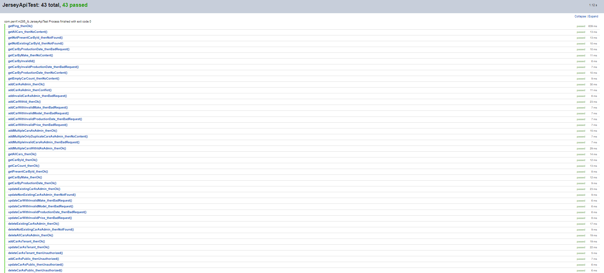

# Name des Projektes
Car Registration (MBudget Strassenverkehrsamt)

## Beschreibung
**Car Registration** ist eine RESTful API Applikation für die Verwaltung einer Sammlung von Fahrzeugen dessen Besitzern.
Sie bietet Endpunkte für das **Erstellen**, **Aktualisieren**, **Abrufen** und **Löschen** von **Autos** sowie für die **Suche**
nach Autos anhand von **verschiedenen Attributen**.
anhand verschiedener Attribute wie Baujahr (`make`) und Herstellungsdatum (`productionDate`).

## Visuals
### Datenbankdiagramm


### Klassendiagramm


### Screenshot der Testdurchführung


*Sonstige Informationen über Verwendung und Tests unter [Sonstiges](#Sonstiges)*

## Validierungsregeln
- Bau und Modell des Autos (`make` | String & `model` | String): Muss zwischen 2 und 45 Zeichen lang sein.
- Herstellungsdatum des Autos (`productionDate` | LocalDate): Muss Vergangenheit oder Gegenwart sein.
- Preis des Autos (`price` | BigDecimal): Muss 0 oder Positiv sein.

## Berechtigungsmatrix
| Endpoint                            | Rolle         | Zugriffstyp   | HTTP-Methode |
|-------------------------------------|---------------|---------------|--------------|
| `/car/ping`                         | Alle          | Abrufen       | GET          |
| `/car`                              | Alle          | Abrufen       | GET          |
| `/car/{id}`                         | Alle          | Abrufen       | GET          |
| `/car/count`                        | Alle          | Abrufen       | GET          |
| `/car/isPresent/{id}`               | Alle          | Abrufen       | GET          |
| `/car/make/{make}`                  | Alle          | Abrufen       | GET          |
| `/car/productionDate/{releaseDate}` | Alle          | Abrufen       | GET          |
| `/car`                              | ADMIN, TENANT | Erstellen     | POST         |
| `/car/multiple`                     | ADMIN, TENANT | Erstellen     | POST         |
| `/car`                              | ADMIN, TENANT | Aktualisieren | PUT          |
| `/car/{id}`                         | ADMIN         | Löschen       | DELETE       |
| `/car`                              | ADMIN         | Löschen       | DELETE       |

### Basic Authorization
| Rolle  | Username | Passwort |
|--------|----------|----------|
| ADMIN  | admin    | 1234     |
| TENANT | tenant   | 1234     |

## Sonstiges
Beim Testing müssen die Datenbanktabellen Leer sein, der Auto-Increment muss auch zurückgesetzt werden.
```mysql
DELETE FROM cars.car;
DELETE FROM cars.owner;
ALTER TABLE cars.car AUTO_INCREMENT = 1;
ALTER TABLE cars.owner AUTO_INCREMENT = 1;
```
Grund dafür, ist, dass anstatt Mocking, alles hardcoded ist.

### Beispiel-Daten
Daten müssen als application/json im Body abgeschickt werden
- Bei einem PUT müsste auch die ID des Autos mitgegeben werden.
```json
{
  "owner": {
    "ahvNr": "1111111111111111"
  },
  "make": "Toyota",
  "model": "A80 Supra MK4",
  "productionDate": [1997, 4, 15],
  "approved": true,
  "price": 27500
}
```

Mehrere neue Einträge JSON:
```json
[
  {
    "owner": {
      "ahvNr": "1111111111111111"
    },
    "make": "Toyota",
    "model": "A80 Supra MK4",
    "productionDate": "1997-04-15",
    "approved": true,
    "price": 27500.00
  },
  {
    "owner": {
      "ahvNr": "2222222222222222"
    },
    "make": "Nissan",
    "model": "R34 GT-R",
    "productionDate": "1999-01-25",
    "approved": true,
    "price": 35000.00
  },
  {
    "owner": {
      "ahvNr": "3333333333333333"
    },
    "make": "Mazda",
    "model": "RX-7 FD",
    "productionDate": "1995-08-20",
    "approved": true,
    "price": 30000.00
  }
]
```

### OpenAPI Dokumentation der Services (Resourcen)
```yaml
openapi: "3.0.0"
info:
  version: "1"
  title: ""
  description: ""
paths:
  /car/ping:
    get:
      operationId: "ping"
      description: ""
      parameters: []
      responses:
        200:
          description: ""
          content:
            text/plain:
              schema:
                type: "string"
  /car:
    get:
      operationId: "getAll"
      description: ""
      parameters: []
      responses:
        200:
          description: ""
          content:
            application/json:
              schema:
                type: "array"
                items:
                  $ref: "#/components/schemas/car"
        204:
          description: ""
          content:
            application/json:
              schema:
                type: "string"
    post:
      operationId: "add"
      description: ""
      parameters: []
      requestBody:
        content:
          application/json:
            schema:
              $ref: "#/components/schemas/car"
      responses:
        200:
          description: ""
          content:
            application/json:
              schema:
                $ref: "#/components/schemas/car"
        409:
          description: ""
          content:
            application/json:
              schema:
                $ref: "#/components/schemas/car"
        500:
          description: ""
          content:
            application/json:
              schema:
                type: "string"
    put:
      operationId: "update"
      description: ""
      parameters: []
      requestBody:
        content:
          application/json:
            schema:
              $ref: "#/components/schemas/car"
      responses:
        200:
          description: ""
          content:
            application/json:
              schema:
                $ref: "#/components/schemas/car"
        404:
          description: ""
          content:
            application/json:
              schema:
                type: "string"
        500:
          description: ""
          content:
            application/json:
              schema:
                type: "string"
    delete:
      operationId: "deleteAll"
      description: ""
      parameters: []
      requestBody:
        content:
          application/json:
            schema:
              type: "string"
      responses:
        200:
          description: ""
          content:
            text/plain:
              schema:
                type: "string"
        500:
          description: ""
          content:
            text/plain:
              schema:
                type: "string"
  /car/{id}:
    get:
      operationId: "getById"
      description: ""
      parameters:
        - in: "path"
          name: "id"
          required: true
          schema:
            type: "number"
      responses:
        200:
          description: ""
          content:
            application/json:
              schema:
                $ref: "#/components/schemas/car"
        404:
          description: ""
          content:
            application/json:
              schema:
                type: "string"
    delete:
      operationId: "delete"
      description: ""
      parameters:
        - in: "path"
          name: "id"
          required: true
          schema:
            type: "integer"
      requestBody:
        content:
          application/json:
            schema:
              type: "string"
      responses:
        200:
          description: ""
          content:
            text/plain:
              schema:
                type: "string"
        404:
          description: ""
          content:
            text/plain:
              schema:
                type: "string"
        500:
          description: ""
          content:
            text/plain:
              schema:
                type: "string"
  /car/count:
    get:
      operationId: "getCount"
      description: ""
      parameters: []
      responses:
        200:
          description: ""
          content:
            text/plain:
              schema:
                type: "string"
        204:
          description: ""
          content:
            text/plain:
              schema:
                type: "string"
  /car/isPresent/{id}:
    get:
      operationId: "getExistsById"
      description: ""
      parameters:
        - in: "path"
          name: "id"
          required: true
          schema:
            type: "integer"
      responses:
        200:
          description: ""
          content:
            text/plain:
              schema:
                type: "boolean"
        404:
          description: ""
          content:
            text/plain:
              schema:
                type: "string"
  /car/make/{make}:
    get:
      operationId: "getByMake"
      description: ""
      parameters:
        - in: "path"
          name: "make"
          required: true
          schema:
            type: "string"
      responses:
        200:
          description: ""
          content:
            application/json:
              schema:
                $ref: "#/components/schemas/car"
        204:
          description: ""
          content:
            application/json:
              schema:
                type: "string"
        500:
          description: ""
          content:
            application/json:
              schema:
                type: "string"
  /car/multiple:
    post:
      operationId: "addMultiple"
      description: ""
      parameters: []
      requestBody:
        content:
          application/json:
            schema:
              type: "array"
              items:
                $ref: "#/components/schemas/car"
      responses:
        200:
          description: ""
          content:
            application/json:
              schema:
                type: "array"
                items:
                  $ref: "#/components/schemas/car"
        204:
          description: ""
          content:
            application/json:
              schema:
                type: "string"
        500:
          description: ""
          content:
            application/json:
              schema:
                type: "string"
  /car/productionDate/{productionDate}:
    get:
      operationId: "getByProductionDate"
      description: ""
      parameters:
        - in: "path"
          name: "productionDate"
          required: true
          schema:
            type: "string"
      responses:
        200:
          description: ""
          content:
            application/json:
              schema:
                $ref: "#/components/schemas/car"
        204:
          description: ""
          content:
            application/json:
              schema:
                type: "string"
        400:
          description: ""
          content:
            application/json:
              schema:
                type: "string"
        500:
          description: ""
          content:
            application/json:
              schema:
                type: "string"
components:
  securitySchemes: {}
  schemas:
    car:
      properties:
        id:
          nullable: false
          type: "integer"
        make:
          nullable: false
          type: "string"
        model:
          nullable: false
          type: "string"
        owner:
          nullable: false
          $ref: "#/components/schemas/owner"
        price:
          nullable: false
          type: "number"
        approved:
          nullable: false
          type: "boolean"
        productionDate:
          nullable: false
          type: "string"
    owner:
      properties:
        id:
          nullable: false
          type: "string"
        cars:
          nullable: false
          type: "array"
          items:
            $ref: "#/components/schemas/car"
        ahvNr:
          nullable: false
          type: "string"
```

## Autor
- Name: Perri Federico
- E-Mail: perrif@bzz.ch
- GitHub: [Perri Federico](https://github.com/perrif-bzz)

## Zusammenfassung
Es wurde eine API erstellt, die getestete Endpunkte zur Verfügung stellt,
mit der Fahrzeuge und deren Besitzer registriert werden können.
Die Dokumentation umfasst ein Datenbank-ERD und ein UML-Klassendiagramm.
Die Testergebnisse wurden in einer generierten HTML-Datei gespeichert, die sich im Wurzelverzeichnis dieses Projekts befindet.
Eine OpenAPI YAML Dokumentation der API ist ebenfalls hier im README verfügbar.
