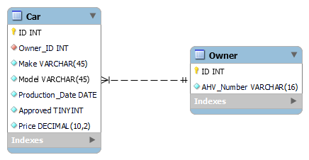

# Name des Projektes
Car Registration API

## Beschreibung
Das Car Registration API Projekt bietet eine umfassende Lösung zur Verwaltung von Autodaten in einer Datenbank. Es ermöglicht Benutzern, Informationen über Autos und ihre Besitzer zu speichern, zu aktualisieren und abzurufen. Die API umfasst mehrere Endpunkte, die verschiedene Aktionen wie das Hinzufügen, Aktualisieren, Abrufen und Löschen von Autodaten unterstützen.

Die Hauptkomponenten der API umfassen:

CarController: Verwaltet die Endpunkte für Autodaten.
Car: Repräsentiert die Entität eines Autos.
Owner: Repräsentiert die Entität eines Autobesitzers.

Ein Besitzer wird durch seine AHV-Nummer identifiziert, dieser kann mehrere Autos besitzen.
Ein Auto wird durch eine Auto-Generierte ID identifiziert, ein Auto kann nur einen Besitzer haben.

## Visuals
### Datenbankdiagramm

### Klassendiagramm

### Screenshot der Testdurchführung

## Validierungsregeln
- Alle Eingabefelder müssen ausgefüllt sein.
- E-Mail-Adressen müssen ein gültiges Format haben.
- Passwörter müssen mindestens 8 Zeichen lang sein und eine Kombination aus Buchstaben und Zahlen enthalten.
- Benutzernamen dürfen keine Sonderzeichen enthalten.

## Berechtigungsmatrix

| Rolle  | Aktion                 | Endpunkt                          |
|--------|------------------------|-----------------------------------|
| Admin  | GET, POST, PUT, DELETE | /car                              |
| Admin  | POST                   | /car/multiple                     |
| Admin  | DELETE                 | /car/{id}                         |
| Admin  | DELETE                 | /car                              |
| TENANT | GET, POST, PUT         | /car                              |
| TENANT | POST                   | /car/multiple                     |
| ALLE   | GET                    | /car                              |
| ALLE   | GET                    | /car/ping                         |
| ALLE   | GET                    | /car/{id}                         |
| ALLE   | GET                    | /car/count                        |
| ALLE   | GET                    | /car/isPresent/{id}               |
| ALLE   | GET                    | /car/make/{make}                  |
| ALLE   | GET                    | /car/productionDate/{releaseDate} |

## OpenAPI Dokumentation der Services (Resourcen)
Die vollständige OpenAPI-Dokumentation ist unter folgendem Link verfügbar: [OpenAPI Dokumentation](./docs/openapi.yaml)

## Autor
- Name: Perri Federico
- E-Mail: perrif@bzz.ch
- GitHub: [Perri Federico](https://github.com/perrif-bzz)

## Zusammenfassung
Dieses Projekt demonstriert die Erstellung und Dokumentation einer API mit verschiedenen Endpunkten zur Datenverwaltung. Die API umfasst umfassende Validierungsregeln, eine klare Berechtigungsmatrix und eine vollständige OpenAPI-Dokumentation, um die Integration und Nutzung für Entwickler zu erleichtern.